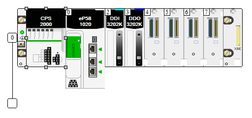
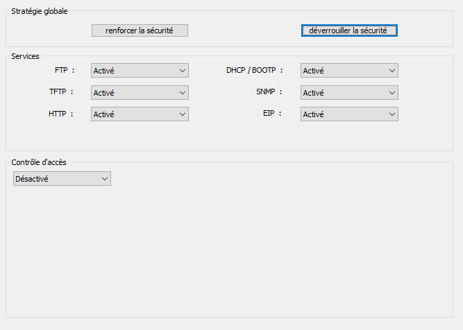
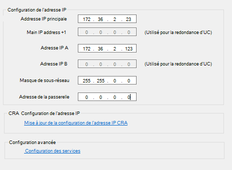
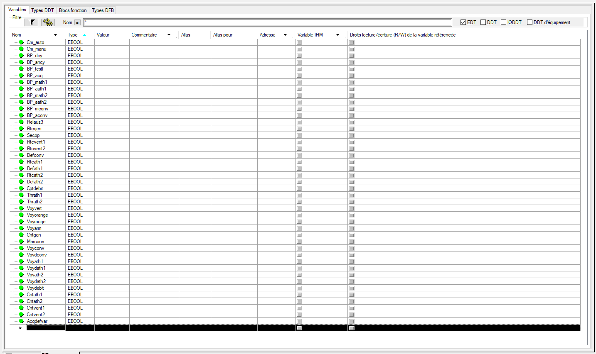
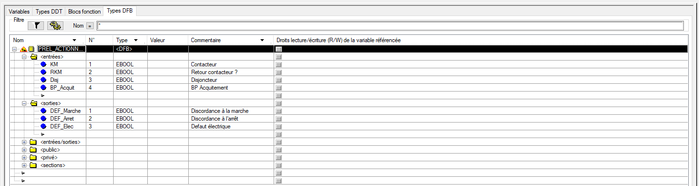
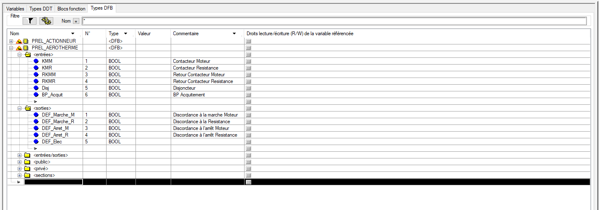
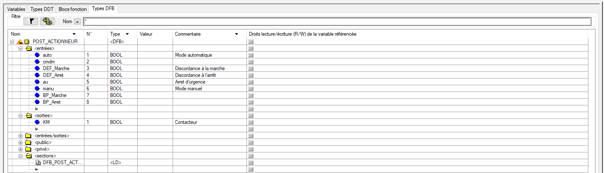
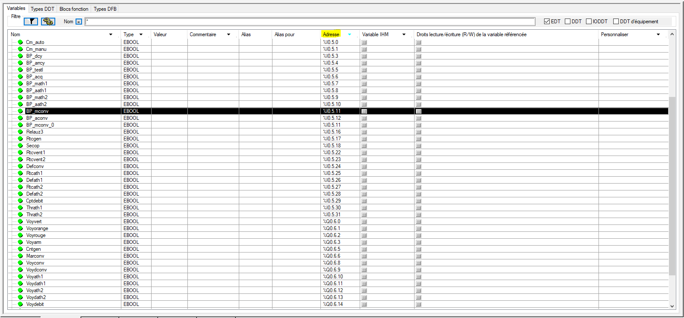

+++
author = "Rémi Lacombe"
title = "TP1 Système automatique"
date = "2019-03-09"
description = "Compte-rendu du TP1"

+++

<!-- MDP_ControlExpert : esieeamiens -->

## Introduction

L'objectif de ces TP est de concevoir la partie contrôle de la Zone 3 de la mini-usine.
Pour le TP1, nous souhaitons créer la partie préliminaire.

## 2. Structuration logicielle de la Partie Commande

Voici le schéma de structure établi :

## 3. Configuration de l'automate

Il faut ensuite créer un nouveau projet et configurer l'automate comme demandé :

On édite ensuite les paramètres de sécurité :

Ainsi que le paramétrage IP :

## 4. Variables élémentaires

Il faut maintenant saisir l'ensemble des entrées/sorties :

## 5. Gestion des sécurités et des défauts : PRÉLIMINAIRE (section DFB)

### 5.1 DFB Actionneurs

On crée un premier bloc DFB pour les actionneurs. On doit premièrement paramétrer les entrées sorties :

Il faut ensuite créer le programme LADDER à l'intérieur du bloc :



>- Les deux premières lignes gèrent les défauts de discordance grâce au bloc **"TON"** qui permet une temporisation.
>- La troisième ligne teste l'état du disjoncteur et enclenche la sortie **"DEF_Elec"** en conséquence.
>- Pour finir, la dernière ligne déclenche les 3 sorties **"DEF_XXX"** en cas d'acquittement.

### 5.2 DFB Aérotherme

On initialise d'abord les variables d'entrées/sorties du bloc :

Puis on crée ensuite le bloc FBD d'un aérotherme :



### 5.3 Préliminaire général

Dans la section Mast, on crée un programme en LADDER, on l'appellera "PREL".

On peut ensuite débuter la programmation. On commence par poser deux blocs DFB_AEROTHERME.
Ici, l'objectif est de lier les variables élémentaires créées plus tôt aux entrées/sorties des blocs DFB_AEROTHERME.
Voici le LADDER résultant :



## 6. Gestion des sorties : POSTÉRIEUR (section DFB)

J'ajoute un bloc DFB dans le préliminaire pour "calculer" le défaut électrique :



On peut enfin débuter le postérieur.

On crée d'abord un bloc LADDER pour le postérieur d'un actionneur. On déclare les variables d'entrées/sorties nécessaires :

Et on établit le programme :



On peut finalement créer le programme POST dans le MAST :



Avant de pouvoir tester, il faut créer un programme de gestion des modes de marche. Ce dernier va permettre d'adapter le fonctionnement suivant le mode sélectionné. On y ajoutera également le contrôle des voyants de la colonne.



On doit à présent mapper les entrées/sorties physiques sur les variables correspondantes :

On peut également créer un programme VOYANTS qui prendra en charge l'affichage de l'ensemble des défauts :



## 7. Séquentiel

### 7.1. Grafcet de conduite (section DFC)

Travaillant seul sur ce TP, je n'ai pas pu le terminer dans les délais impartis, je compléterai ce rapport au fil de mon avancement pour le terminer avant le 08 décembre.
